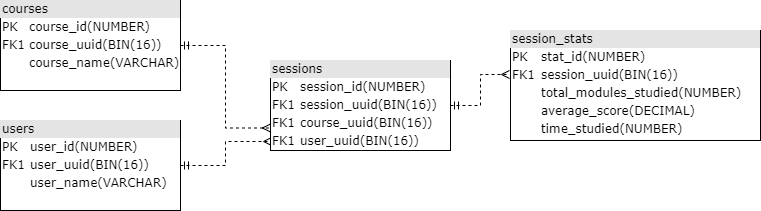
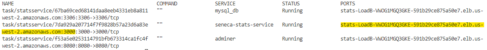
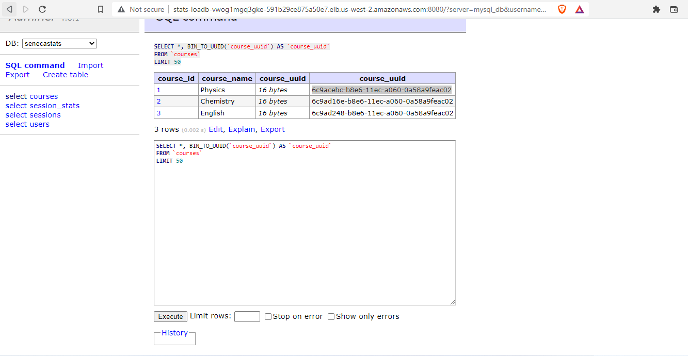
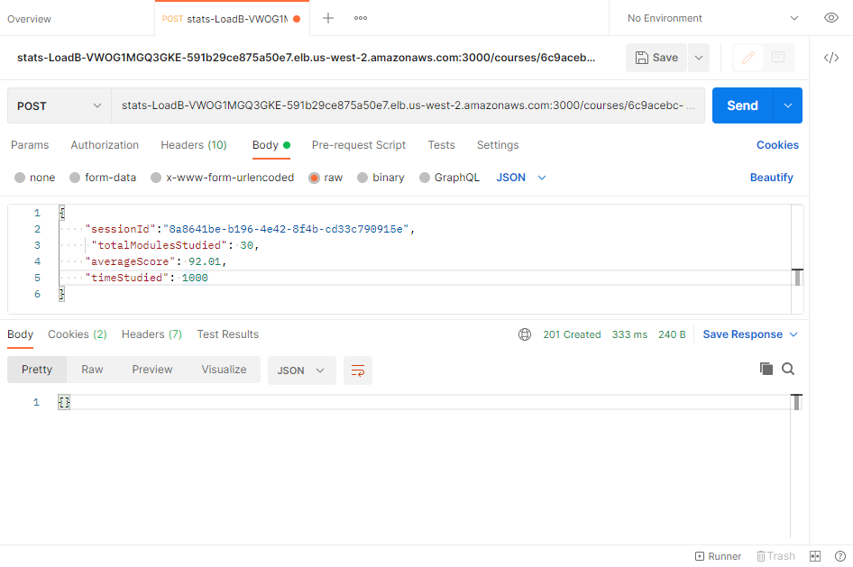

# Seneca Stats API

## Requirements

- Stats are posted based on the completion of a learning session.
- Stats can be fetched via an aggregated call which aggregates a users stat history for a course they are studying.
- Stats should also be fetchable for a single learning session.
- The service must be easily runnable/startable & deployable on the
  AWS ecosystem by the reviewer of the task. Other than node.js being the main language, any technlogy can be
  used.
- The project should be submitted in the form of a code repository.
- Please state any assumptions or deviations from the specification in the repository readme.
- Stats should be persisted using a database of your choosing
- Your service should have some level of tests

## Terminology

Course - refers to a course on a particular subject that a user is learning. A course is made up of learning sessions.

Session - refers to a learning session that a user studies. Sessions are made up of modules that display content.

Modules - display content to the user. There are 15 module types and these are
used depending on the type of content that is being displayed.

## Assumptions:
* Each session is linked to one course and one user only.
* It is assumed that session data can be modified. Hence, upsert SQL commands are used.
* It is also assumed that session data isn't pre-existent in the database. Hence the implementation includes the creation of sessions related to courses and users if they don't exist in the DB at the time of stats submission. Subsequently, the stats of that particular session are upserted. This uses a transaction based query. 

## Data Model
 

## Testing

Install [NodeJS](https://nodejs.org/en/download/current/)(>=17.7). Then install Typescript globally using the command.
```
npm install -g typescript
```

Clone the repository and change to the parent directory.
```
git clone https://github.com/AjaSharma93/StatsService 

cd StatsService
```
Install all required modules.
```
npm install
```
API and functional tests using Jest can then be run using the command,
```
npm run test
``` 

## Deployment:
Clone the repository and change to the parent directory on the command line.
```
git clone https://github.com/AjaSharma93/StatsService 

cd StatsService
```
Download, install and configure AWS-CLI from [here](https://aws.amazon.com/cli/).  
Download and install [Docker](https://www.docker.com/products/docker-desktop/) and [Docker-compose](https://docs.docker.com/compose/install/). Additonally, for linux machines install [Docker-compose CLI](https://docs.docker.com/cloud/ecs-integration/#install-the-docker-compose-cli-on-linux).  
Configure the AWS CLI by providing the access token and secret with the command,
```
aws configure
```
Login to AWS ECR using the following command:
```
aws ecr get-login-password --region <region> | docker login --username AWS --password-stdin <aws_account_id>.dkr.ecr.<region>.amazonaws.com

Example:
aws ecr get-login-password --region us-west-2 | docker login --username AWS --password-stdin 582573384015.dkr.ecr.us-west-2.amazonaws.com
```
Setup the ECR Repository for the API.
```
aws ecr create-repository --repository-name seneca_stats_service --image-scanning-configuration scanOnPush=true 
```
Open **docker-compose.yaml** in the parent directory, copy the URI in the output to the **image** attribute of the section **seneca-stats-service**.  

Run the build command from the parent directory,
```
docker compose build
```
Upload the images with the following command,
```
docker compose push
```
Create a new context in Docker with the AWS credentials required.
```
docker context create ecs myecscontext
```
Switch to the context.
```
docker context use myecscontext
```
Finally deploy the services.
```
docker compose up
``` 
The services can then be listed using the following command.
```
docker compose ps
```
   

**Adminer** (running on port **8080**) is used to handle any database queries with the following login credentials (listed in docker-compose.yaml):  
Username: **aja**  
Password: **admin123**
 

## API requests
**API** (running on port **3000**) requests can then be made to the URL as listed in `docker compose ps`. 
 

References:  
https://docs.aws.amazon.com/AmazonECR/latest/userguide/getting-started-cli.html  

https://www.docker.com/blog/docker-compose-from-local-to-amazon-ecs/  

https://aws.amazon.com/blogs/containers/deploy-applications-on-amazon-ecs-using-docker-compose/
